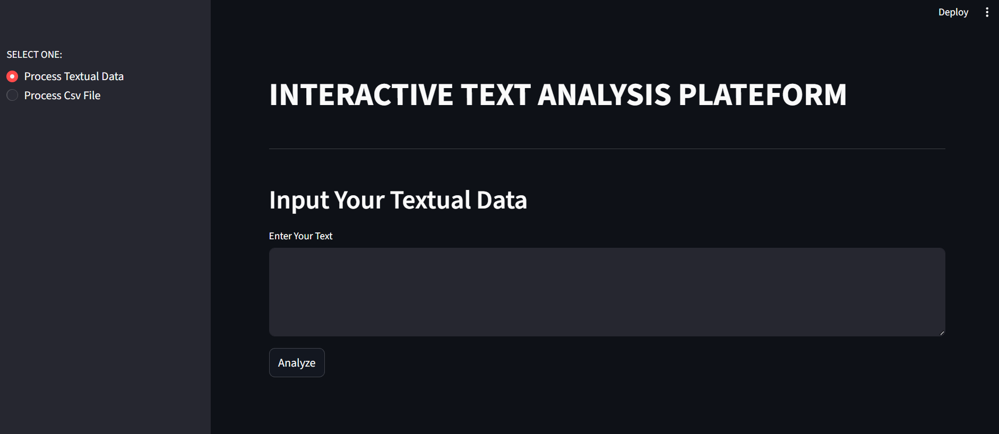
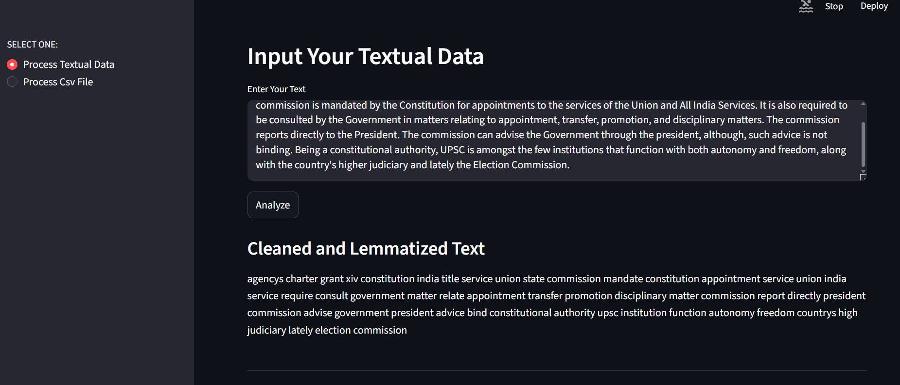
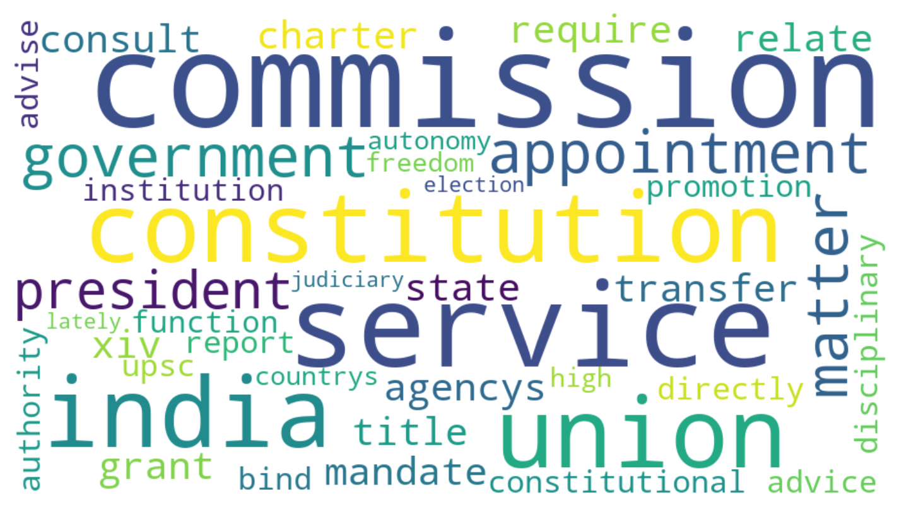
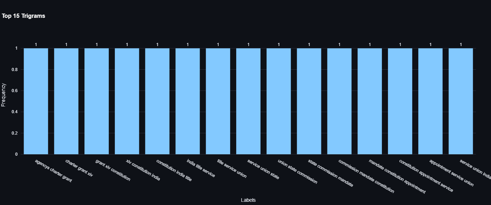
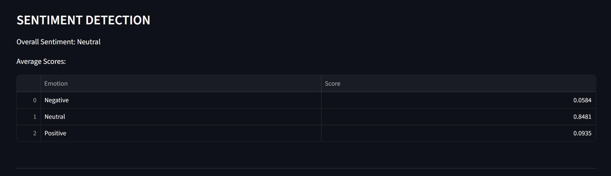
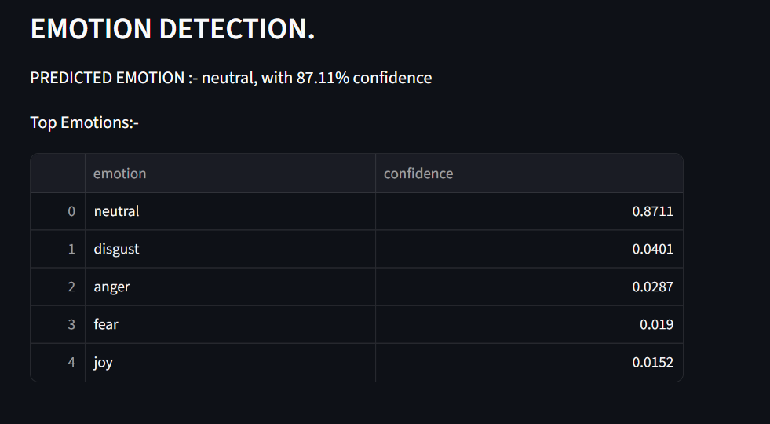
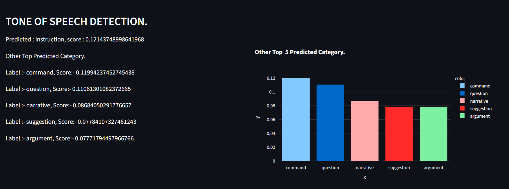
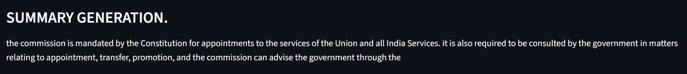
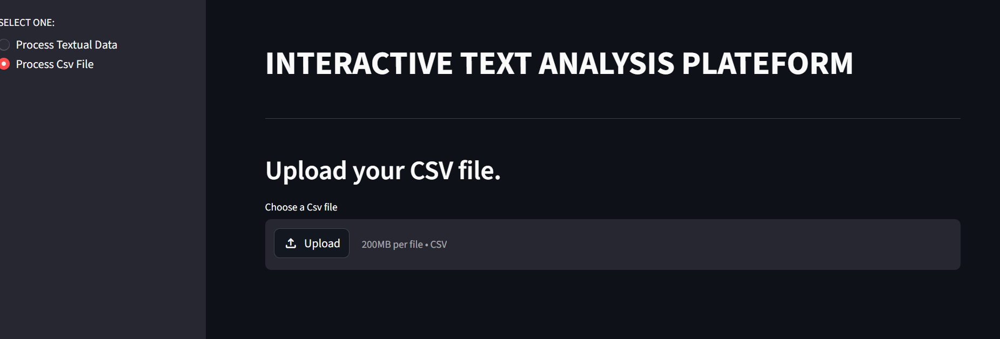
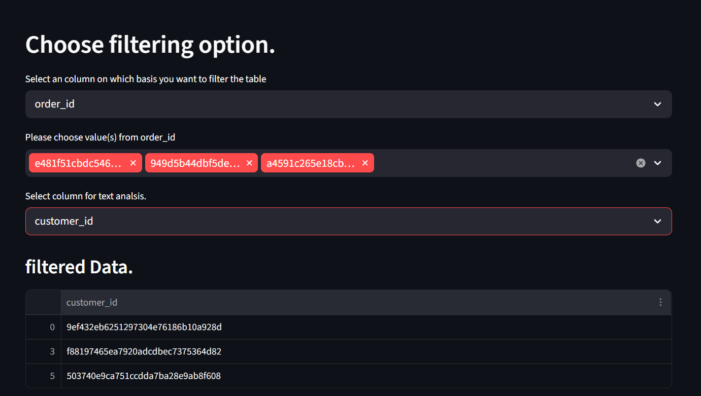

# Interactive Text Analysis Platform

A self-service NLP utility dashboard I built using Streamlit to ingest unstructured textual data and systematically extract linguistic intelligence. This tool handles everything from automated regex preprocessing and tokenization up to heavy deep learning inference layers using local Hugging Face pipelines.

---

## 🛠️ System Architecture & Workflow

Instead of a monolithic script, I broke the project down into three distinct, modular components to preserve clean code boundaries:

1. **`text_cleaner.py` (The Preprocessing Layer)**: Uses Python's native `re` library alongside `spacy` (`en_core_web_sm`) to handle sentence tokenization, custom stop-word removal, and full lemmatization.
2. **`nlp_functions.py` (The Inference Engine)**: Houses the pipeline setups for our 4 transformer models. I integrated memory caching here via `@st.cache_resource` to keep page re-renders fast.
3. **`app.py` (The Interactive Layout)**: Renders our Streamlit dashboard workspace, controls data uploading logic, parses CSV data frames, and handles our charting layouts.

---

## 🖥️ Feature Walkthrough & Interface Previews

### 1. Data Ingestion & Preprocessing
The platform accepts direct copy-paste strings or bulk `.csv` uploads. Once loaded, the raw text passes directly through `text_cleaner.py` to strip out noise before compiling statistics.

<p align="center">
  
  
</p>

### 2. Frequency Visualizations & N-Gram Extraction
To move past simple word clouds, I added a localized N-gram analytics layer. The app parses the clean text array into sequential tokens to map out frequent Unigrams, Bigrams, and Trigrams.

```python
# A quick look at how the N-grams are compiled behind the scenes:
def extract_ngrams(text_tokens, n=2):
    return list(zip(*[text_tokens[i:] for i in range(n)]))
```

<p align="center">
  
  
</p>

### 3. Deep Learning Insights (Hugging Face Pipelines)
This is where the heavy text classification takes place. The dashboard pipes your clean data into four specialized, pre-trained Hugging Face models simultaneously:

* **Sentiment Analysis** (`cardiffnlp/twitter-roberta-base-sentiment`): Tracks positive/negative shifts.
* **Emotion Tracking** (`j-hartmann/emotion-english-distilroberta-base`): Monitors fine-grained emotional responses.
* **Zero-Shot Tone Analysis** (`facebook/bart-large-mnli`): Detects formal vs. casual structures.
* **Abstractive Summarization** (`google-t5/t5-small`): Synthesizes long blocks into crisp summaries.

### 3. Deep Learning Insights (Hugging Face Pipelines)

This is where the heavy text classification takes place. The dashboard pipes your clean data into four specialized, pre-trained Hugging Face models simultaneously.

<!-- SENTIMENT AND EMOTION DETECTION GRID -->
<div align="center" style="display: flex; justify-content: center; align-items: middle; gap: 15px; margin-bottom: 20px;">
  
  
</div>

<!-- TONE AND SUMMARY GENERATION GRID -->
<div align="center" style="display: flex; justify-content: center; align-items: middle; gap: 15px;">
  
  
</div>


### 4. Custom Bulk Data Filtration
When a user uploads a CSV file, the app activates structural layout filters, letting you isolate specific rows or columns of text before pushing the clean batch into the analytics pipelines.

<p align="center">
  
  
</p>

---

## ⚡ Setup & Local Execution

To replicate this environment locally, follow these configuration steps:

### 1. Standard Installation
```bash
git clone https://github.com
cd interactive-text-analysis
python -m venv venv
source venv/bin/activate  # Windows: venv\Scripts\activate
pip install -r requirements.txt
```

### 2. Language Model Provisioning
Since spaCy requires an external pipeline download, run this step to pull down the English dictionary model:
```bash
python -m spacy download en_core_web_sm
```

### 3. Launch App
```bash
streamlit run app.py
```


The app will compile and automatically launch in your default web browser at `http://localhost:8501`.

---


